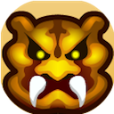
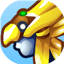
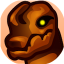
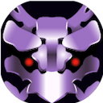
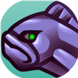
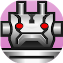
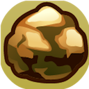
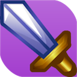
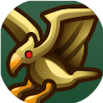
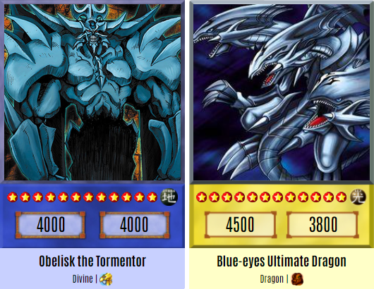

# Criação de Cartas Yu-Gi-Oh!

## Sobre o projeto
* Projeto criado com o intuito de aprimorar os meus conhecimentos na área, inspirado no site <a href="https://www.cardmaker.net/yugioh/">Yugioh Card Maker</a>, o projeto tem as seguintes funções: 
   <ol>
      <li>Criar</li>
      <li>Deletar</li>
      <li>Listar</li>
   </ol>  

* Ferramentas utilizadas na criação do projeto:
   <ol>
      <li><b>HTML, CSS, JS</b>: Desenvolvimento front-end.</li>
      <li><b>NodeJS</b>: Desenvolvimento backend.</li>
      <li><b>Banco de dados</b>: MongoDB.</li>
      <li><b>Handlebars</b>: Template que permite utilizar códigos JS dentro do HTML.</li>
      <li><b>Api Imgur</b>: Armazenamento e retorno da imagem que foi inserida.</li>
      <li><b>Editor</b>: Visual Studio Code</li>
   </ol> 

## Criação de cartas

* Você pode criar os seguintes tipos de cartas:

   
 
      
      aqua
   

     
   
  
       
      beast-warrior
   

   

      
      beast
   

   

      
      dinosaur
   

   

       
      divine
   

   

      
      dragon
   

  

  
   fairy
  

  

  
   fairy
  

  

  
   fiend
  

  

  
   fish
  

  
   
   
      
      insect
   

   
  
      
      machine
   

     
   
 
      
      plant
   

   
 
      
      pyro
   
  
   
 
      
      reptile
   
  
   
 
      
      rock
   
  
   
 
      
      sea-serpent
     
   
 
      
      spellcaster
   

   
 
      
      thunder
   
  
   
 
      
      warrior
   

   
 
      
      winged-beast
   
  
   
 
      
      zombie
   
   
   

    

   * Quando uma carta é criada com o tipo <b>Divine</b> a cor dela será azul, os demais tipos a cor será amarela.

   

   * O ataque e defesa não ultrapassam de <b>9999</b>. 
   * Só é possível inserir imagens dos tipos: <b>PNG, JPEG, JPG</b> ou <b>JFIF</b>.
   * Todos os campos devem ser preenchidos!

    

   * Projeto 100% responsivo.
   * <a href="https://yugioh-create-card.herokuapp.com/">Visualizar Projeto</a>
