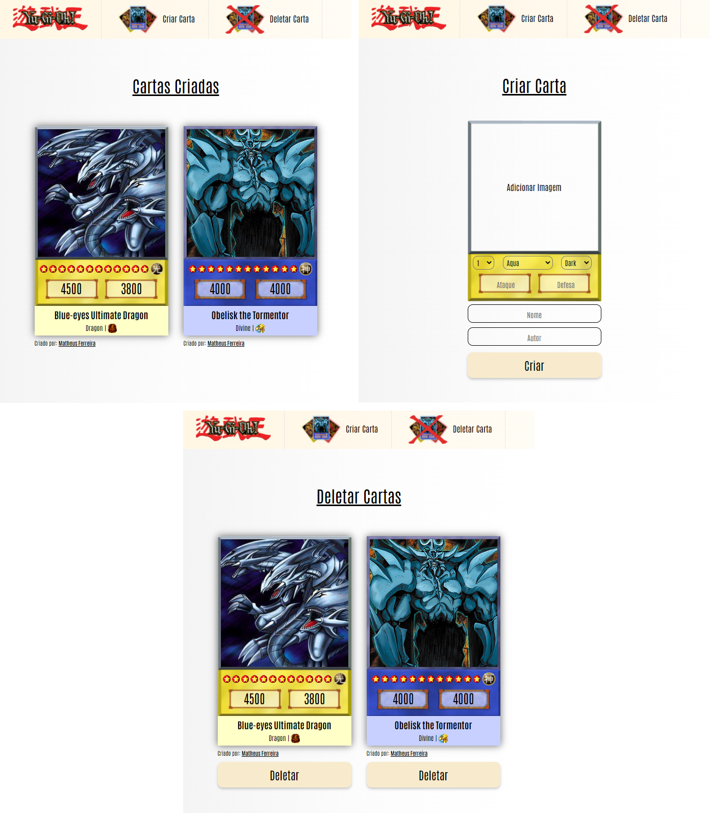

# Criação de Cartas Yu-Gi-Oh!

## Sobre o projeto
Projeto criado com o intuito de aprimorar os meus conhecimentos em desenvolvimento web, inspirado no site <a href="https://www.cardmaker.net/yugioh/">Yugioh Card Maker</a> 

<a href="https://yugioh-create-card.herokuapp.com/">Visualizar Projeto</a>

### Funcionalidades

* Criar
* Deletar
* Listar

#### Tipos permitidos

Icon | Tipo
:---- | :----
 | Aqua
  | Beast-warrior
 | Beast
 | Dinosaur
  | Divine
 | Dragon
 | Fairy
 | Fiend
 | Fish
 | Insect
 | Machine
 | Plant
 | Pyro
 | Reptile
 | Rock
 | Sea-serpent
 | Spellcaster
 | Thunder
 | Warrior
 | Winged-beast
 | Zombie

 

* Quando uma carta é criada com o tipo <b>Divine</b> a cor dela será azul, os demais tipos a cor será amarela.

* O ataque e defesa não ultrapassam de <b>9999</b>. 
* Só é possível inserir imagens dos tipos: <b>PNG, JPEG, JPG</b> ou <b>JFIF</b>.
* Todos os campos devem ser preenchidos.

### Desenvolvimento

* Ferramentas utilizadas na criação do projeto:

 <ol>
    <li><b>HTML, CSS, JS</b>: Desenvolvimento front-end.</li>
    <li><b>NodeJS</b>: Desenvolvimento backend.</li>
    <li><b>Banco de dados</b>: MongoDB.</li>
    <li><b>Handlebars</b>: Template que permite utilizar códigos JS dentro do HTML.</li>
    <li><b>Api Imgur</b>: Armazenamento e retorno da imagem que foi inserida.</li>
    <li><b>Editor</b>: Visual Studio Code</li>
 </ol> 
